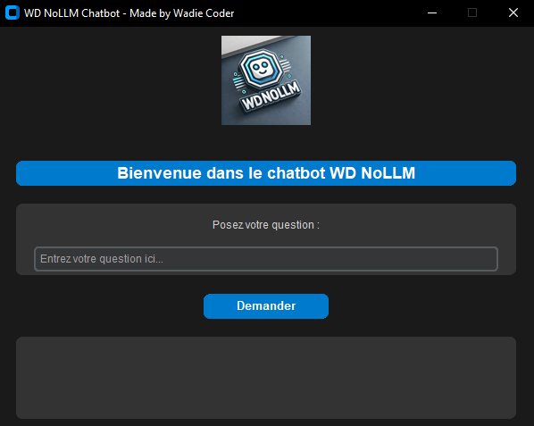

# WD NoLLM Chatbot

**WD NoLLM Chatbot** is a simple and customizable chatbot application designed to make it easy for students and AI beginners to create their own bots. With this application, you don’t need to dive into complex language models (LLMs) or advanced AI techniques. All you need to do is modify a simple JSON file (`data.json`) to customize the bot’s responses based on your chosen topic.

## UI Screenshot
<p align="center">
  
</p>

## Why Use WD NoLLM Chatbot?
The goal of WD NoLLM Chatbot is to simplify the process of creating custom bots for various topics without requiring advanced knowledge of language models or machine learning. Whether you're a student learning about AI or just curious about building a chatbot, this app provides an easy-to-understand framework to get started. You only need to update the `data.json` file to make your chatbot respond to questions related to any topic you choose.

The application is designed to be beginner-friendly and fast, allowing you to have a working chatbot in no time, focusing on the essentials of building chatbots and learning the basics of text comparison and data storage.

## Features
- **Customizable**: Easily change the topic of your bot by editing the `data.json` file.
- **Simple Setup**: No need to learn complex LLMs or advanced AI. Just modify the predefined question-answer pairs in the JSON file.
- **Easy-to-use Interface**: The chatbot has a clean, modern UI built with customtkinter.
- **Text Comparison**: Uses difflib for simple text comparison, making the bot’s responses highly accurate for predefined data.

## Installation

### Run the Script Directly
To run the chatbot locally, follow these simple steps:

1. **Clone or Download the Repository**: Get the source code by downloading or cloning the repository.
2. **Install Required Packages**: Install the required Python packages:
    ```bash
    pip install customtkinter
    pip install pillow
    ```
3. **Run the Script**: Navigate to the directory containing the script and run it:
    ```bash
    python NoLLMChatbot.py
    ```

## Customizing Your Bot
Customizing the bot to respond to your desired topic is very easy. You simply need to modify the `data.json` file, which contains predefined question-answer pairs. Here’s a sample structure of the `data.json`:

```json
[
    {
        "question": "What is AI?",
        "answer": "Artificial Intelligence (AI) is the simulation of human intelligence in machines that are programmed to think and learn like humans."
    },
    {
        "question": "What is machine learning?",
        "answer": "Machine learning is a subset of AI that allows systems to learn and improve from experience without being explicitly programmed."
    }
]
```

You can add as many question-answer pairs as needed for your desired topic. For instance, if you want to build a chatbot about "Physics", just update the `data.json` with physics-related questions and answers.

## Future Improvements
WD NoLLM Chatbot is just getting started! Future updates will include:
- Enhanced text comparison for more accurate answers.
- Support for more customization options in the user interface.
- Additional features to allow more advanced users to explore LLM-like functionality.

## Made with Love by Wadie Coder
This application was created with passion and care by **[wadiecoder.com](https://www.wadiecoder.com)**.

## Contact Me
If you have any questions or suggestions, feel free to reach out to me via email:

**Email**: [wadie@wadiecoder.com](mailto:wadie@wadiecoder.com)

**Instagram**: [@wadie.coder](https://www.instagram.com/wadie.coder/)
